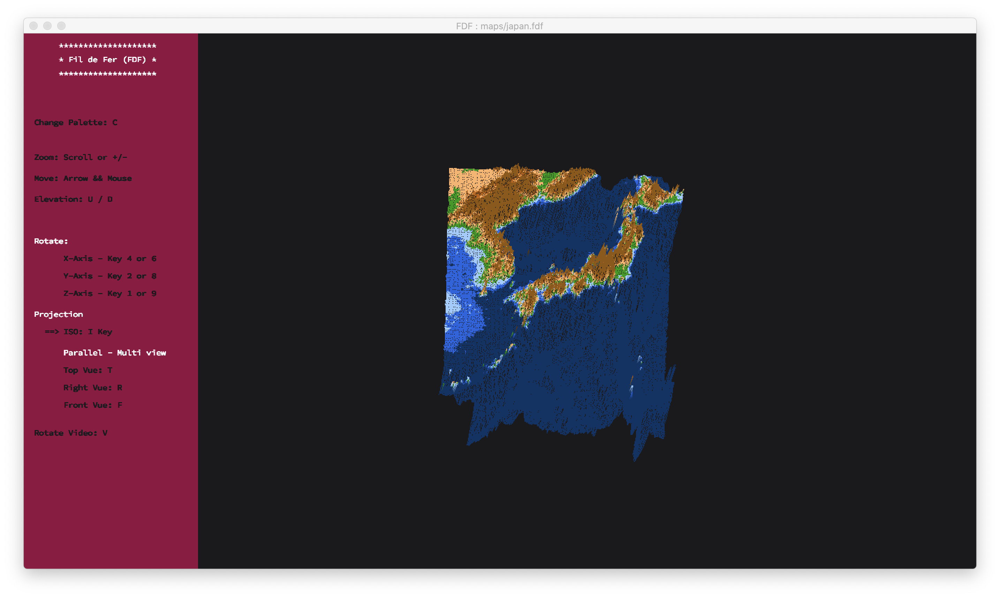
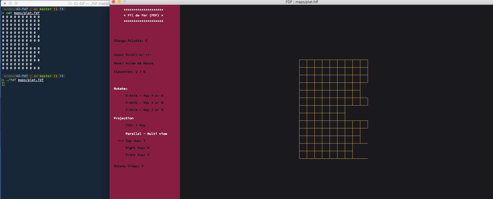
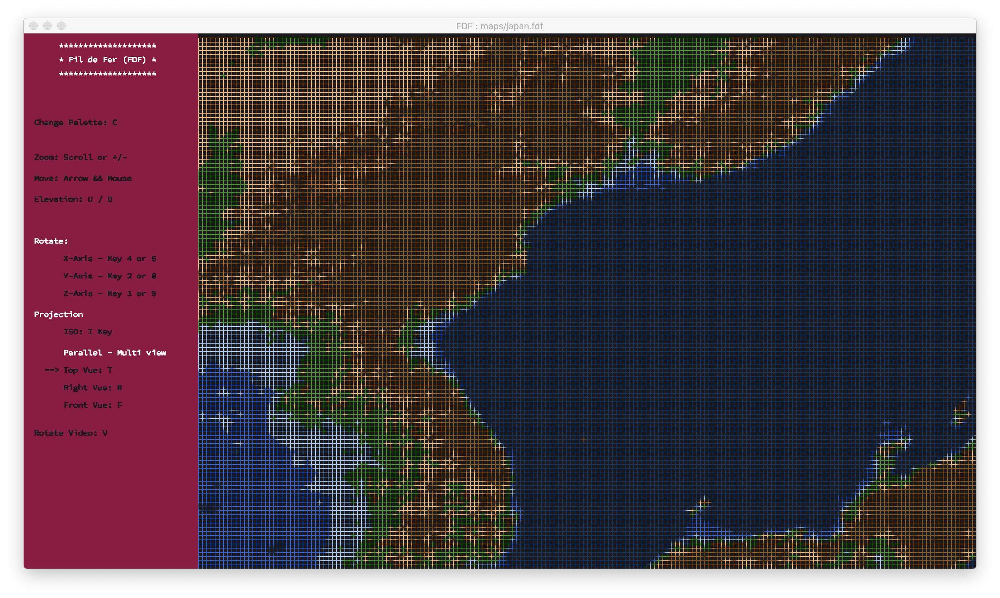
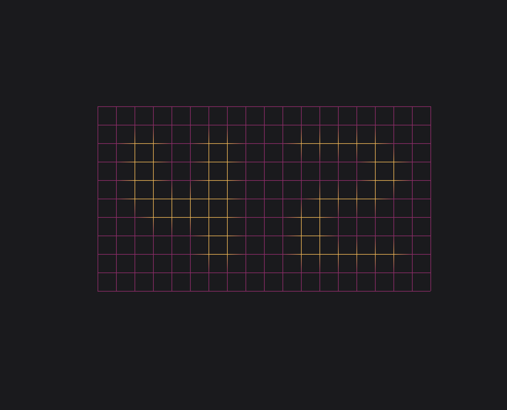
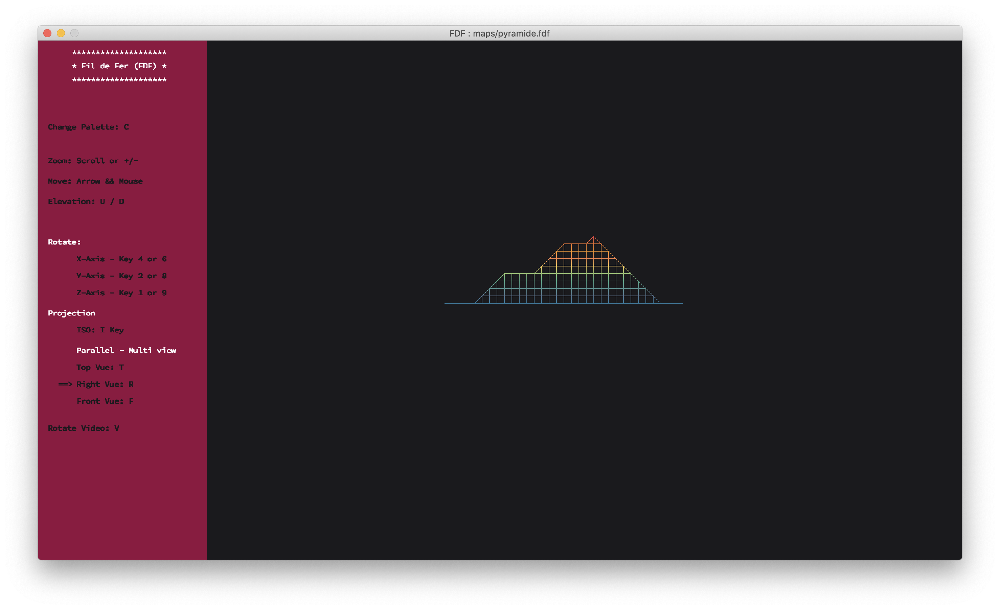

# 42-fdf

This project is about creating a simplified 3D graphic representation of a
relief landscape.


```
make
```
```
./fdf maps/MAP_FILE.fdf
```




## MiniLibX

[Minilibx tutorial](https://harm-smits.github.io/42docs/libs/minilibx)

- Only compilation on macOS tested

## FDF
### Features

#### MAP

<table style="padding:10px">
  <tr>
    <td> 
         <ul>
          <li>Read Z and hex color</li>
           <li>Can Read map with differnet number of lines</li>
         </ul>
    </td>
    <td> 
         
    </td>
  </tr>
</table>

#### COLORS

- gradient between two point
- multiple palette selection
- Colors from the map file on palette 1
- palette for earth maps

#### ROTATION AND TRANSLATIONS

- Rotations with Keys
- TRanslation with Keys and Mouse
- Rotation video _(keep changing angle until we press V again)_

#### ZOOM



### Other projections

<table style="padding:10px">
  <tr>
    <td>
         <h7>Top</h7>
         
    </td>
    <td> 
          <h7>Right</h7>
         
    </td>
    <td> 
          <h7>Front</h7>
         
    </td>
  </tr>
</table>
